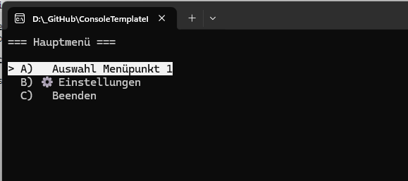

# Projektname


]

## Projekt Template

Dieses Projekt ist ein Template für ein Windows Konsolenprogramm, das in .NET 10.0 und C# 14 geschrieben ist. Es bietet eine einfache Struktur, um schnell Funktionen und Features zu testen, ohne sich um die Einrichtung eines komplexen Projekts kümmern zu müssen.
Das Menü und die Struktur kann beliebig angepasst werden.



## Projekt für einen Window Konsolenprogramm
Das kleine Konsolenprogramm dient zum Testen von Funktionen und Features in .NET 10.0 / C# 14. Es ist ein einfaches Template, das schnell angepasst werden kann, um verschiedene Funktionen oder Fingerübungen zu testen.

## Beispielsource

der Source ist soll auch einfache Art und Weise die Funktionen eines Features zeigen. Der Source ist so geschrieben, das so wenig wie möglich zusätzliche NuGet-Pakete benötigt werden.
```csharp
private static void Main(string[] args)
{
    CMenu unterMenu = new CMenu("Untermenü");
    unterMenu.AddItem("Untermenüpunkt 1", () => UnterMenuPoint("A"), "🖥");
    unterMenu.AddItem("Untermenüpunkt 2", () => UnterMenuPoint("B"), "🔊");

    CMenu mainMenu = new CMenu("Hauptmenü");
    mainMenu.AddItem("Auswahl Menüpunkt 1", MenuPoint1);
    mainMenu.AddSubMenu("Einstellungen", unterMenu, "⚙");
    mainMenu.AddItem("Beenden", () => ApplicationExit());
    mainMenu.Show();
}
```
